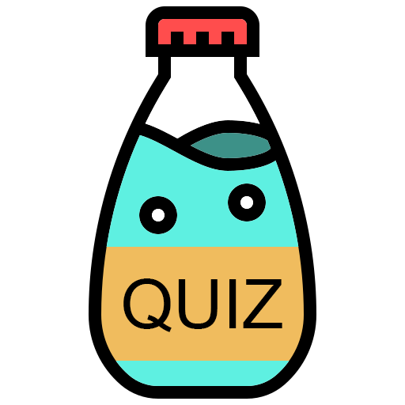
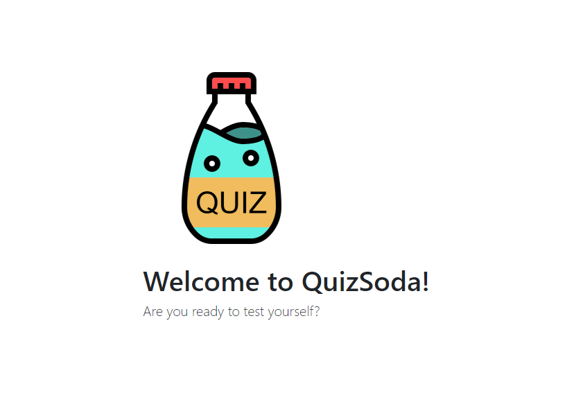
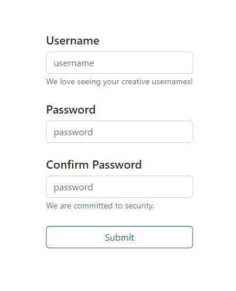
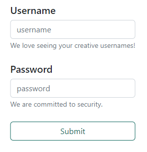
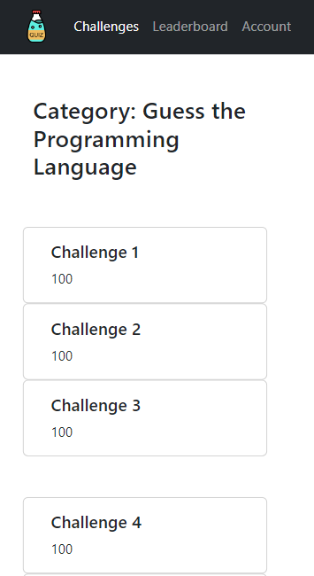
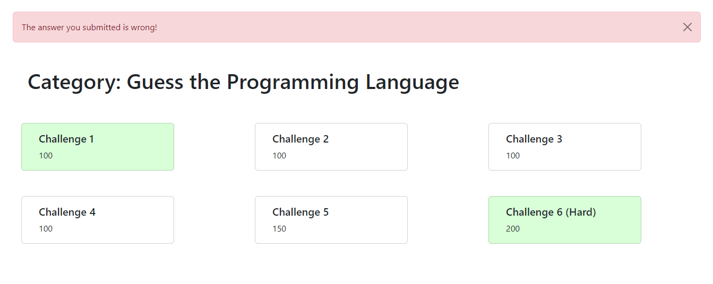
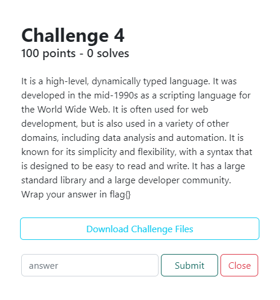
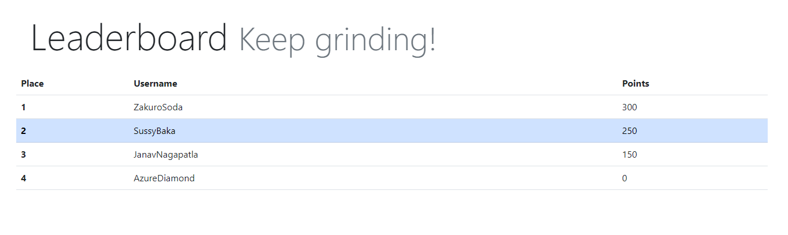
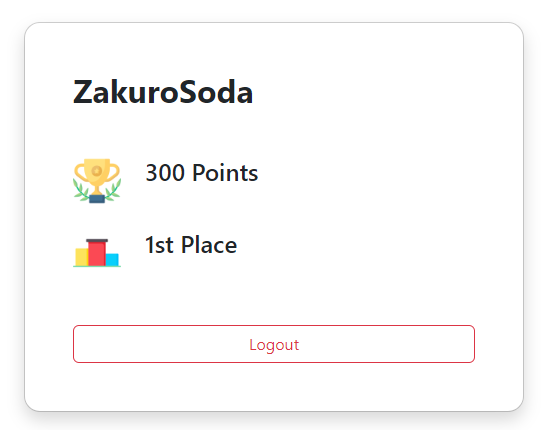

## QuizSoda

  

Hello there! QuizSoda is a highly simplified quiz/CTF platform.  


---

Written in:
- Frontend: Bootstrap
- Backend: Flask
- Language: Python
- DB: SQL (SQLite)

We have reached beta stage.

## Documentation

1. Run `setup.py`.
```bash
python3 setup.py
```
2. Run `app.py`
```bash
python3 app.py
```
3. Check `http://127.0.0.1:5000/`

### Challenge Upload Guide

Upload challenges with the following format.

```
└── challenges
    ├── category
        └── challenge name
            ├── DESCRIPTION
            ├── FLAG
            ├── POINTS
            └── dist.zip (optional)
     ├── category
        └── challenge name
            ├── DESCRIPTION
            ├── FLAG
            └── POINTS
```

### Gallery









